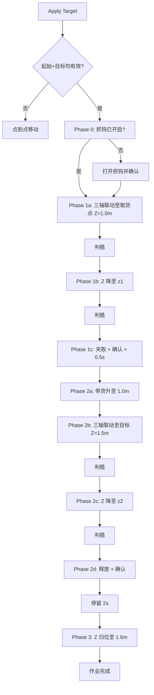

# LST 起重机完整调度流程

本文档描述 `OperationScheduler` 实现的钢卷取放作业流程，与代码 `operation_scheduler.py` 保持一致。

---

## 1. 坐标与状态定义

| 名称 | 符号 | 含义 | 来源 |
|------|------|------|------|
| 初始状态 | `(x0, y0, z0)` | 起重机当前位置 | 定位算法（SLAM / 仿真） |
| 起始位置 | `(x1, y1, z1)` | 钢卷所在位置（取货点） | 调度算法或 UI |
| 目标位置 | `(x2, y2, z2)` | 钢卷送达位置（卸货点） | 调度算法或 UI |

- 坐标系为 map / crane 坐标（现场标定），Z 为绝对高度（相对地面）。
- UI 点击 **Apply Target** 且起始位置、目标位置均有效时，执行完整取放流程。
- 仅给出起始位置或目标位置之一时，执行简单的点到点移动（不含抓钩动作）。

---

## 2. 安全高度约定

所有安全高度均为**绝对高度**（相对地面），可在 `CraneConfig` 中配置：

| 参数 | 默认值 | 用途 |
|------|--------|------|
| `approach_safe_z` | 1.0 m | 取货阶段 XY 联动时的 Z 安全高度 |
| `transport_safe_z` | 1.5 m | 运输阶段 XY 联动时的 Z 安全高度 |
| `return_safe_z` | 1.6 m | 作业完成后 Z 归位高度 |

---

## 3. 完整作业流程概览

```
Phase 0  取货前确认抓钩已开启
    ↓
Phase 1  取货：接近 → 下降 → 判稳 → 夹取
    ↓
Phase 2  运输：带货上升 → 运输 → 下降 → 判稳 → 释放 → 停留 2s
    ↓
Phase 3  Z 归位到 1.6 m
    ↓
完成
```

---

## 4. 各阶段详细说明

### Phase 0：取货前确认抓钩已开启

**目的**：避免上次作业异常结束（急停、故障）后抓钩仍停留在夹紧状态，带着闭合抓钩接近钢卷。

| 步骤 | 动作 |
|------|------|
| 1 | 读取抓钩状态 |
| 2 | 若已开启（释放）→ 直接进入 Phase 1 |
| 3 | 若未开启（夹紧）→ 调用 `GripperRelease` 打开一次，等待释放到位确认 |

> 这是一次性状态纠正，**不做持续控制或额外安全延时**；后续接近取货位置本身仍有足够时间。

---

### Phase 1：取货

#### Phase 1a — 三轴联动接近取货位置

- **目标**：`(x1, y1, approach_safe_z)`，即 XY 到取货点、Z 先到 1.0 m 安全高度。
- **控制**：X、Y、Z 三轴 PD 联动；Z 先到安全高度后等待 XY 到位。
- **判稳**：XY 到位后执行**自适应判稳**（见第 5 节），上限 `stabilize_delay`（默认 1.0 s）。

#### Phase 1b — Z 下降到取货高度

- **目标**：`(x1, y1, z1)`。
- **控制**：仅 Z 轴下降，XY 保持。

#### Phase 1c — 夹取钢卷

| 步骤 | 动作 |
|------|------|
| 1 | 自适应判稳（上限 `gripper_settle_max_wait`，默认 2.0 s） |
| 2 | 调用 `GripperClamp` 夹紧 |
| 3 | 轮询等待夹紧到位确认（超时 5 s，软失败） |
| 4 | 固定等待 `gripper_safety_delay`（0.5 s） |

---

### Phase 2：运输与卸货

#### Phase 2a — 带货上升到取货安全高度

- **目标**：`(x1, y1, approach_safe_z)`（1.0 m）。

#### Phase 2b — 三轴联动运输到目标

- **目标**：`(x2, y2, transport_safe_z)`，即 XY 到卸货点、Z 先到 1.5 m 安全高度。
- **判稳**：XY 到位后自适应判稳（上限 1.0 s）。

#### Phase 2c — Z 下降到卸货高度

- **目标**：`(x2, y2, z2)`。

#### Phase 2d — 释放钢卷

| 步骤 | 动作 |
|------|------|
| 1 | 自适应判稳（上限 2.0 s）——**关键安全点**：货物未放稳时不释放 |
| 2 | 调用 `GripperRelease` 释放 |
| 3 | 轮询等待释放到位确认（超时 5 s，软失败） |
| 4 | **停留 `post_release_lift_delay`（默认 2.0 s）**——释放完全确认后再抬升，避免抓钩刚打开就上升 |

---

### Phase 3：Z 归位

- **目标**：`(x2, y2, return_safe_z)`（1.6 m）。
- **控制**：释放确认并停留 2 s 后，以正常速度直接抬升，不做分段限速。

---

## 5. 自适应判稳机制

在以下节点触发，替代原先“固定等待 1 s”的盲等逻辑：

1. XY 到达取货位置后（Phase 1a → 1b）
2. Z 下降到取货高度后、夹取前（Phase 1c）
3. XY 到达目标位置后（Phase 2b → 2c）
4. Z 下降到卸货高度后、释放前（Phase 2d）

**判据**（滑动窗口 `hook_settle_window`，默认 0.6 s）：

- 窗口内 X/Y/Z 位置峰峰值 < `hook_settle_pos_tol`（0.02 m）
- 窗口首尾平均漂移速度 < `hook_settle_vel_tol`（0.012 m/s）

**行为**：

- 已静止 → 提前放行（可能远小于等待上限，提升效率）
- 仍在摆动 → 持续等待直到平稳或达到上限（软失败，打印警告后继续）

---

## 6. 抓钩状态

### 6.1 控制接口（PLC）

| 函数 | 作用 |
|------|------|
| `GripperClampOnControl` / `GripperClampOffControl` | 电平保持式控制（互斥） |
| `GetGripperOnStatus` | 读取夹紧到位状态 |
| `GetGripperOffStatus` | 读取释放到位状态 |

> 现场实测：`GetGripperOnStatus` 表示“夹紧到位”，`GetGripperOffStatus` 表示“释放到位”。  
> 这两个信号反映的是**抓钩机构限位**，不能判断是否真的夹住钢卷（无称重/负载传感器）。

### 6.2 ROS 备用读取

话题 `/crane/cmd_vel/anguler` 的 `angular.x`：

| 值 | 含义 |
|----|------|
| -1 | 抓钩开启（释放） |
|  1 | 抓钩关闭（夹紧） |

调度器优先使用 PLC 状态，ROS 作为 fallback。

### 6.3 状态确认超时

- 轮询间隔：0.1 s
- 确认超时：5.0 s
- 超时行为：打印警告，**假定动作已完成并继续**（软失败，避免传感器偶发故障中断作业）

---

## 7. 时序参数汇总

| 参数 | 默认值 | 说明 |
|------|--------|------|
| `stabilize_delay` | 1.0 s | XY 到位后判稳等待上限 |
| `gripper_settle_max_wait` | 2.0 s | Z 到位后、抓钩动作前判稳上限 |
| `gripper_safety_delay` | 0.5 s | 夹紧确认后固定等待 |
| `post_release_lift_delay` | **2.0 s** | 释放确认后、开始抬升前停留 |
| `GRIPPER_CHECK_TIMEOUT` | 5.0 s | 抓钩状态确认超时 |

---

## 8. 控制与定位

- **运动控制**：PD（可选积分项 `ki_pos`）位置到速度伺服，10 Hz 控制循环。
- **XY 位置**：SLAM / 定位反馈。
- **Z 位置**：优先使用 PLC `GetActualLiftHeight()` 抓钩实测高度。
- **到位精度**：目标残余误差约 0.02 m 量级（现场可继续调 `ki_pos` 等参数）。

---

## 9. 异常与中断

| 情况 | 行为 |
|------|------|
| 操作员 STOP | 立即中止，状态设为 STOPPED |
| 定位断流 / 连续坏帧 | 超过容忍预算后安全停车 |
| 抓钩状态超时 | 警告后继续（软失败） |
| 判稳超时 | 警告后继续（软失败） |
| 急停 | 仅停运动，**不改变抓钩状态**（避免带载时误松开） |

---

## 10. 流程图（Mermaid）



---

## 11. 相关代码

| 模块 | 文件 |
|------|------|
| 作业编排 | `operation_scheduler.py` |
| 配置参数 | `crane_model.py` → `CraneConfig` |
| PLC 接口 | `plc_interface.py` |
| 抓钩 ROS | `ros_bridge.py` |
| PD 控制 | `pd_controller.py`, `crane_model.run_pd_control()` |
